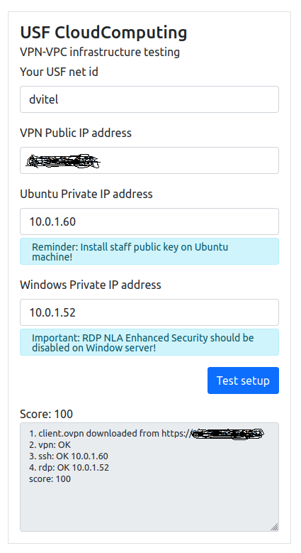

# USF CloudComputing VPN-VPC infrastructure checker 

This is check automation of infrastructure that students are supposed to setup in AWS Cloud. Related to CIS4083. 
Short infrastructure description: 

1. VPC with private and public subnets are created 
2. OpenVPN server is set up in public subnet with staff password as is specified in assignment. 
3. Ubuntu machine with staff ssh key 
4. Windows RDP with correctly installed user and disabled NLA Enhanced security. 

## Running tester: node index.js [-v] [--gui] [--server]
Configuration config.json contains additional parameters. 
1.  -v - verbose mode with all output of ovpn download, vpn connect, ssh and rdp. 
2.  --gui - runs ovpn download with gui. Default is headless mode to run on servers. 
3.  --server - starts web server on port specified in config.json. Exposes UI and also web endpoint to check config from command line with curl. Without --server all parameters are taken from config.json. 

Example of curl requests to tester server:
```bash
curl -X POST -H "Content-Type: application/json" -d '{"login":"<id>","vpnServer":"1.2.3.4","sshServer":"10.0.1.60","rdpServer":"10.0.1.52"}' http://localhost:3001/vpn-vpc
```

## Student Web UI

Web UI is used by students to check their infrastructure without requesting TAs. 
Scores and tries are logged. Best score could be used for assignment grading.



## Testing server setup 

Environment init 

This section is intended for TAs to create tester for students before assignment starts. 
Currently there is no automation of tester infrastructure setup - possible Dockerisation or CloudFormation script.

Prerequisites (check init.sh script for hints)
1. Ubuntu AMI 
2. apt-get openvpn 
3. install latest nodes and npm 
4. git this repo
5. npm install 
6. Install puppeteer dependencies 
7. Create systemd service with usf-vpn-vpc.service  
8. IMPORTANT: copy staff pem private key into file system of tester and specify in config the path to it - to check ssh connection. 
9. IMPORTANT: copy students.csv file into cwd of server (TODO: put this into config). Format should be next:
```csv 
Student,ID,Login
"Student Name 1",id1,login1
"Student Name 2",id2,login2
...
```
10. Review and edit config.json on tester. Specify path to key, pass phrase for it, setup from assignment, timeouts and rubric points.

Content of students.csv could be taken from canvas. This file plays role of authorisation database to run checks. TAs could add separate records for them to check tester setup.

All attempts are logged into stats.json (or file specified in config.json). This file could be used at the end to get bests scores of students. 

## VPC assignment (NOTES from 04/04/22)

Add staff key into [permanent ssh config](https://stackoverflow.com/questions/3466626/how-to-permanently-add-a-private-key-with-ssh-add-on-ubuntu): ~/.ssh/config. Modify assignment to  ask students to add testing server to security group.

Add [ssh-agent deamon as systemctl service](https://gist.github.com/magnetikonline/b6255da90606fe9c5c25d3333c98c90d)